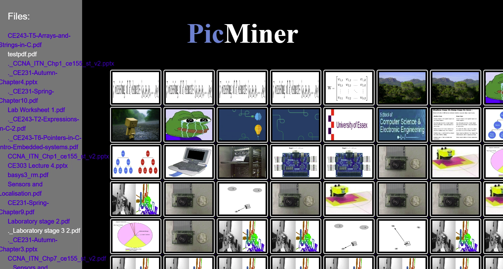

# Pic-Miner
A Software tool which can filter out images from a chosen directory and output them in an HTML file.

This was a group project and it was completed during three months period.

* Unit Testing was done
* GUI designed
* HTML File Designed

##### This is the final output of the software

